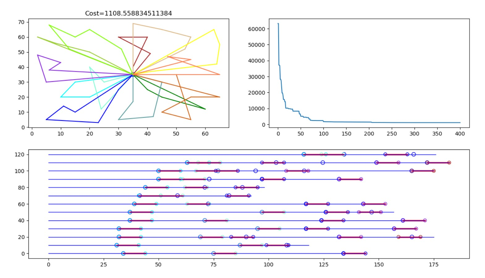
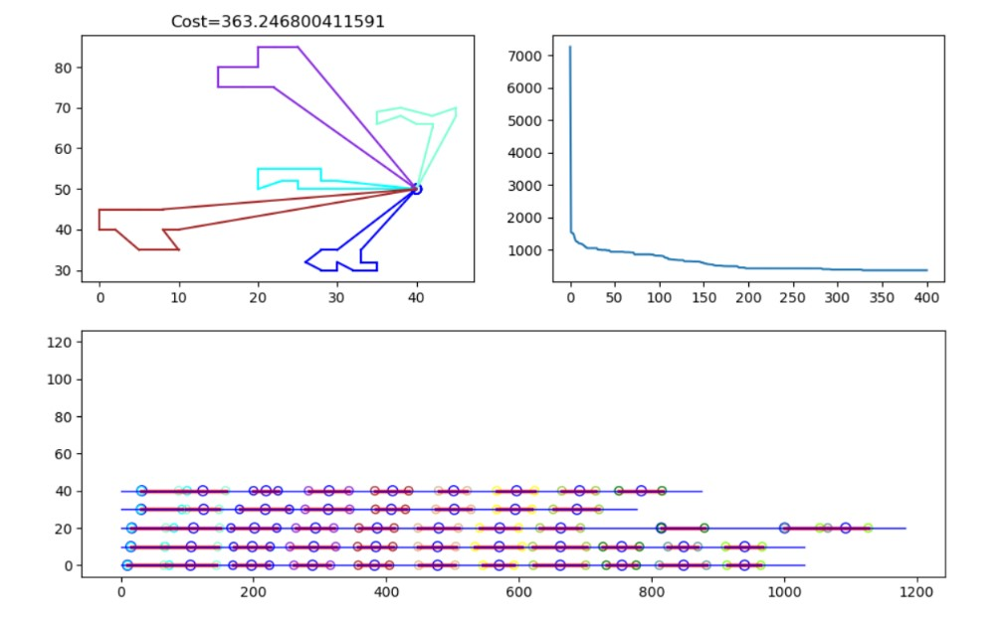
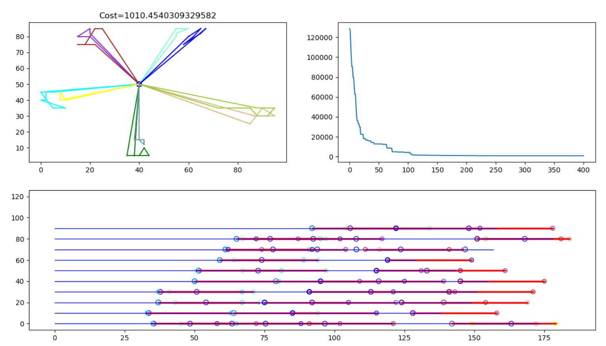
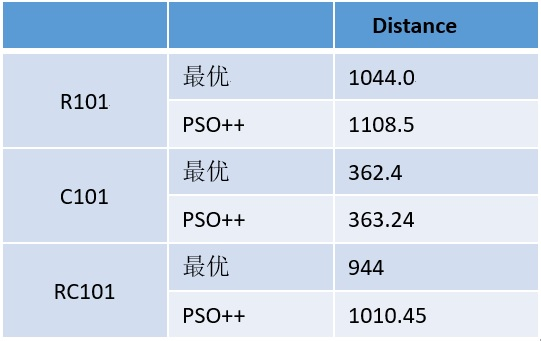

#PSO++ (for VRPTW)#

## What is PSO
In computational science, particle swarm optimization (PSO)[1] is a computational method that optimizes a problem by iteratively trying to improve a candidate solution with regard to a given measure of quality. It solves a problem by having a population of candidate solutions, here dubbed particles, and moving these particles around in the search-space according to simple mathematical formulae over the particle's position and velocity. Each particle's movement is influenced by its local best known position, but is also guided toward the best known positions in the search-space, which are updated as better positions are found by other particles. This is expected to move the swarm toward the best solutions.
>wikipedia
## 什么是PSO算法
粒子群算法（PSO，Particle Swarm Optimization）是在1995年由Eberhart博士和Kennedy博士一起提出的，它源于对鸟群捕食行为的研究。它的基本核心是利用群体中的个体对信息的共享从而使整个群体的运动在问题求解空间中产生从无序到有序的演化过程，从而获得问题的最优解。

## What is VRPTW
The vehicle routing problem (VRP) is a combinatorial optimization and integer programming problem which asks "What is the optimal set of routes for a fleet of vehicles to traverse in order to deliver to a given set of customers?". It generalises the well-known travelling salesman problem (TSP). It first appeared in a paper by George Dantzig and John Ramser in 1959,[1] in which first algorithmic approach was written and was applied to petrol deliveries. Often, the context is that of delivering goods located at a central depot to customers who have placed orders for such goods.
And the VRPTW means each customer limit a time windows[Begin server time, end server time]. 
## 什么是VRPTW问题
带时间窗的车辆路径问题（VRPTW）是典型的NP-hard问题。最早由Dantzig和Ramser于1959年首次提出，它是指一定数量的客户，各自有不同数量的货物需求，配送中心向客户提供货物，由一个车队负责分送货物，组织适当的行车路线，目标是使得客户的需求得到满足，并能在一定的约束下，达到诸如路程最短、成本最小、耗费时间最少等目的。

## PSO++（PSO plus plus）
传统PSO便于处理连续性问题，我们在参考PSO处理VRTTW问题paper的基础上提出了我们的改进算法。主要有以下优势：
1.	改进了位置的更新公式。使用轮盘赌算法，使得粒子在保持该粒子，粒子最优解，粒子群最优解之间选择，并且有变异因子防止陷入局部最优。与其他的使用粒子速度来进行优化相比，本算法具有更好的收敛性。
2.	结合了两篇paper的长处：加入了早到的时间惩罚、晚到的罚金惩罚， 将输入订单提前排序，显著提高收敛速度。
3.	能同时处理软、硬时间窗的VRPTW问题。
4.	车辆载重量不同的情况下依然能求解，且能产生很好的解。
5.	按路线、时间线画图等形式直观的展示了解决方案。
## 数据集
我们采用经典的Solomon数据集作为输入："http://w.cba.neu.edu/~msolomon/problems.htm "
我们在R101、C101、RC101数据集上进行了实验，可见效果非常好：

